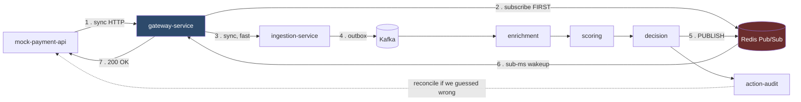

# Real-Time Fraud Detection Pipeline

Seven Spring Boot services that decide **ALLOW / REVIEW / BLOCK** on a payment before it
completes, within a hard 150ms budget — over a fully asynchronous Kafka backbone.

Everything runs locally on real infrastructure: real Kafka, real Redis, real Couchbase. No
in-memory fakes, no cloud dependency, one `docker compose up`.

> **Status: all seven services built. T1–T10 all pass, including T10 at 18/18 against the live
> 10-container stack. Measured warm end-to-end latency: p50 30ms, max 32ms — inside the 150ms
> budget.** Built in the phase order of [the spec's §12](FRAUD_PIPELINE_BUILD_SPEC.txt); see
> [Build status](#build-status) for the per-phase record and the gaps still tracked as issues.

---

## The interesting problem

A payment caller needs an answer **in this request cycle** — it cannot complete a payment without
knowing whether it is fraud. But the detection pipeline wants to be **asynchronous** internally,
so that one slow stage cannot cascade, stages scale independently, and everything is replayable.

Those two requirements are in direct conflict, and the resolution is the core of the design:



**One synchronous leg** to durably accept the transaction, then a **bounded, event-driven wait**
on a Redis Pub/Sub channel keyed by correlation ID. Sub-millisecond wakeup, and on WebFlux no
thread is held while waiting. If 150ms elapses first the caller gets **REVIEW — never ALLOW** —
and the pipeline keeps running, with a webhook reconciling later if the real decision differs.

Three details that make it work, each with a failure mode it prevents:

- **Subscribe before ingesting.** Redis Pub/Sub has no persistence. On a warm stack the pipeline
  finishes in under 40ms — faster than the gateway could call ingestion and *then* subscribe. Get
  the order wrong and every request times out, and the failure gets **worse the faster your
  pipeline is**. → [ADR-0003](docs/adr/0003-pubsub-not-polling.md)
- **Transactional outbox.** The transaction record and its outbox event commit in one Couchbase
  ACID transaction. Without it, a crash between the DB write and the Kafka publish leaves a
  transaction that is durably recorded and **silently never scored**.
  → [ADR-0005](docs/adr/0005-transactional-outbox.md)
- **REVIEW, never ALLOW, on timeout.** Otherwise every GC pause and rebalance silently becomes
  "let everything through" — and load spikes correlate with fraud waves.
  → [ADR-0004](docs/adr/0004-review-not-allow-on-timeout.md)

---

## Services

| Service | Port | Role |
|---|---:|---|
| `mock-payment-api` | 8080 | Simulated upstream caller + webhook receiver. Makes the sync/async seam demonstrable rather than hypothetical. |
| `gateway-service` | 8081 | **WebFlux.** HMAC JWT, rate limiting, correlation ID, and the bounded wait. |
| `ingestion-service` | 8082 | Idempotency + the outbox. Owns the durability boundary. |
| `enrichment-service` | 8083 | Behavioural signals from Redis, all via atomic Lua scripts. |
| `scoring-service` | 8084 | Weighted rule engine. Hot-reloadable, no restart. |
| `decision-service` | 8085 | Policy thresholds → ALLOW/REVIEW/BLOCK. Publishes the wakeup. |
| `action-audit-service` | 8086 | Append-only ledger, alerts, webhook reconciliation. |

Each is an independent Maven project with its own `pom.xml` and Dockerfile. **No shared compiled
library** — contracts are JSON Schema in [`docs/CONTRACTS.md`](docs/CONTRACTS.md), and every
consumer is a tolerant reader. → [ADR-0002](docs/adr/0002-no-shared-dto-jar.md)

---

## Quick start

**Requirements:** Docker + Compose v2, Java 21, `curl` + `jq` (for the example commands below),
~4.6 GB free RAM, ~4 GB free disk.
Maven is *not* required — each module ships a script-only Maven Wrapper (`./mvnw`), so nothing
needs installing and nothing needs sudo.

```bash
./scripts/preflight.sh        # checks RAM, disk and host ports; fails loudly rather than mid-build
docker compose up -d          # infra + init jobs today (Phase 1); brings up all 7 services once later phases land
./scripts/smoke-test.sh       # exercises every scenario, prints PASS/FAIL per scenario
```

**Right now** `docker compose up -d` brings up Kafka, Redis, Couchbase, the two init jobs and
`ingestion-service` — six containers. The remaining six application services join
`docker-compose.yml` as their phases land; `smoke-test.sh` needs them to be present to do anything
useful. You can exercise ingestion directly today:

```bash
curl -s -X POST localhost:8082/internal/v1/ingest -H 'Content-Type: application/json' \
  -d '{"transactionId":"txn-demo-1","customerId":"cust-1","merchantId":"merch-1",
       "merchantCategoryCode":"5411","amount":150.00,"currency":"INR","countryCode":"IN",
       "deviceId":"dev-1","paymentMethod":"CARD","correlationId":"demo-corr-1"}' | jq
# => 202 {"transactionId":"txn-demo-1","correlationId":"demo-corr-1","status":"ACCEPTED"}
# repeat the same command => status becomes DUPLICATE, and no second Kafka event is produced
```

Init containers create the 9 Kafka topics, the Couchbase bucket / 3 scopes / 7 collections, the
N1QL indexes and the 8 seed rules automatically. There are no manual setup steps.

**If preflight reports a port conflict** — most commonly because you already run Couchbase Server
natively, which owns 8091/8093/11210 — copy `.env.example` to `.env` and change the host ports.
Only host-side mappings move; service-to-service traffic inside the compose network is unaffected.

```bash
cp .env.example .env          # then edit CB_UI_PORT / CB_QUERY_PORT / CB_KV_PORT
```

Subsets, since the full stack is heavy:

```bash
docker compose up -d redis kafka-init couchbase-init   # infra only
```

`depends_on` pulls Kafka and Couchbase in behind their init jobs; Redis has no dependent at this
stage, so it is named explicitly. Compose profiles are deliberately not used — a profiled service
is excluded from a bare `docker compose up`, which would break the one-command start spec §14
requires.

### Try it by hand

```bash
# clean transaction → ALLOW
curl -s -X POST localhost:8080/payments/initiate \
  -H 'Content-Type: application/json' \
  -d '{"transactionId":"txn-demo-1","customerId":"cust-1","merchantId":"merch-1",
       "merchantCategoryCode":"5411","amount":150.00,"currency":"INR",
       "countryCode":"IN","deviceId":"dev-1","paymentMethod":"CARD"}' | jq
```
```json
{ "status": "COMPLETED", "fraudDecision": "ALLOW", "riskScore": 0,
  "resolvedBy": "PIPELINE" }
```

`resolvedBy` is the field to watch: `PIPELINE` means a real decision arrived inside the budget;
`TIMEOUT_DEFAULT` means you got the safe default. In production, `TIMEOUT_DEFAULT ÷ total` is the
system's primary SLO.

```bash
# trip the velocity rule — 6 transactions in under a minute
for i in $(seq 1 6); do
  curl -s -X POST localhost:8080/payments/initiate \
    -H 'Content-Type: application/json' \
    -d "{\"transactionId\":\"txn-vel-$i\",\"customerId\":\"cust-velocity\",
         \"merchantId\":\"merch-1\",\"merchantCategoryCode\":\"5411\",\"amount\":100.00,
         \"currency\":\"INR\",\"countryCode\":\"IN\",\"deviceId\":\"dev-1\",
         \"paymentMethod\":\"CARD\"}" | jq -c '{i:'$i', d:.fraudDecision, s:.riskScore}'
done
```

The 6th trips `VELOCITY_1M` (threshold 5, weight 30) → score 30 → **REVIEW / HELD**.

```bash
# follow one transaction across all 7 services
docker compose logs --no-color | grep "$(curl -s ... | jq -r .correlationId)"

# change a rule with no restart, as a fraud analyst would
# (edit rule::VELOCITY_1M in Couchbase, then:)
curl -X POST localhost:8084/admin/rules/refresh
```

---

## How to test

```bash
cd scoring-service && ./mvnw verify   # one service — Testcontainers, real infra
./scripts/test-all.sh                 # everything
./scripts/smoke-test.sh               # end-to-end against a live stack
```

Ten scenarios from spec §10 are implemented as automated tests against **real** Kafka, Redis and
Couchbase. Full detail: [`docs/TEST_PLAN.md`](docs/TEST_PLAN.md).

Two are worth calling out because of *how* they are written:

- **T5** (cooperative rebalancing) is parameterized across **both** assignors and asserts the
  scenario *fails* under `RangeAssignor`. The naive version — kill an instance, assert everything
  eventually processed — passes under eager rebalancing too, and would prove nothing.
- **T6** (Redis outage) asserts degraded signal keys are **absent** from the signal map, not that
  they are zero. A test asserting `velocity_1m == 0` would pass on the zero-defaulting
  implementation that [ADR-0014](docs/adr/0014-redis-fail-open.md) specifically rejects.

---

## What would break, and how you would notice

The three signals that matter, and what they mean:

| Signal | Healthy | What it tells you |
|---|---|---|
| `TIMEOUT_DEFAULT ÷ total decisions` | < 1% | What fraction of decisions were *real* decisions |
| `fraud_ingestion_outbox_pending` | ≈ 0 | Climbing = Kafka unreachable or publisher dead. Earliest warning available. |
| `fraud_enrichment_signal_degraded_total` | 0 | Decisions being made partly blind |

### Redis outage
Payments **keep flowing** — this is designed, not broken. Velocity/geo/device signals are
**omitted** (never defaulted to zero — zero is a positive claim of innocence, invented from
nothing) and `signalsDegraded: true` is carried onto the decision and into the audit ledger. Rate
limiting fails open. Idempotency survives, because its authority is Couchbase `insert()`, not
Redis. **Accepted risk:** velocity-based fraud is likelier to succeed during the outage; every
affected decision is identifiable afterwards.
*Notice it:* `signal_degraded` counter, WARN logs in enrichment.

### Kafka consumer rebalance
Only the partitions actually transferring pause; the rest keep flowing. Expect a small bump in
`TIMEOUT_DEFAULT`, not a cliff. **If the whole group stalls, cooperative rebalancing is not in
effect** — most likely a *mixed* group, since one eager member forces the entire group back to
eager.
*Notice it:* consumer-group lag on non-transferring partitions.

### Kafka down
Ingestion still returns 202 — the Couchbase commit is the durability boundary. Outbox rows
accumulate as `PENDING`. **Nothing is lost.** Drains automatically on recovery.

### Couchbase down
The one place the system fails **closed**: ingestion returns 503. Accepting a transaction that
cannot be made durable would be a promise the system cannot keep.

Full symptom-first guide, including the immortal-Redis-counter bug and the stuck-partition case:
[`docs/RUNBOOK.md`](docs/RUNBOOK.md).

---

## Documentation

| Document | What is in it |
|---|---|
| [HLD](docs/HLD.md) | Architecture, the sync/async seam, topic topology, latency budget, failure domains |
| [LLD](docs/LLD.md) | Cross-cutting design + [per-service](docs/lld/) internals, class designs, sequence diagrams |
| [CONTRACTS](docs/CONTRACTS.md) | JSON Schema for every message shape. **Load-bearing** — there is no shared DTO jar |
| [ADRs](docs/adr/) | 15 decisions, each with its naive alternative and named failure mode |
| [TEST_PLAN](docs/TEST_PLAN.md) | T1–T10 acceptance criteria |
| [CONFORMANCE](docs/CONFORMANCE.md) | Spec §9 and §14 audited against actual call sites, with file:line references |
| [RUNBOOK](docs/RUNBOOK.md) | Symptom-first operations guide |
| [INTERVIEW_PREP](docs/INTERVIEW_PREP.md) | Design walkthrough, trade-off drills, failure-mode Q&A |

---

## Stack

Java 21 · **Spring Boot 4.1.0** · Apache Kafka 4.2 (KRaft, single node) · Redis 7 ·
Couchbase Server 7.6 Community Edition · Testcontainers 2.0.5 · Micrometer + Prometheus

**On Spring Boot:** the spec pins 3.3.x, but every Spring Boot 3.x branch is EOL as of mid-2026 —
3.5.16 was the final OSS 3.x release. Running an unpatched runtime in the payment path contradicts
the system's purpose, so this builds on 4.1.0. The full dependency set was resolved and every
load-bearing class verified present *before* any code was written.
→ [ADR-0001](docs/adr/0001-spring-boot-4.md)

**On Couchbase Community Edition:** the spec assumes multi-document ACID transactions work on CE,
which the entire outbox pattern depends on. Couchbase's product-comparison page lists distributed
transactions as Enterprise, which would invalidate it. The spec is right and the page is
misleading — SDK transactions are implemented client-side via ATR documents, with no server-side
service to license.

Because the cost of being wrong is high and discovered late, this was **not taken on faith**.
`infra/couchbase-probe` runs against a real CE container and is a Phase 1 gate — the outbox was not
built until it was green. It verifies, all 6 green:

- multi-document ACID transaction commits both documents
- a failed transaction **rolls back both** (a commit-only test would pass on a system with no
  transaction support at all, since two sequential inserts also leave both documents present)
- `insert()` throws on a duplicate key and does not overwrite
- the Binary Collection counter is exact under 20 concurrent writers × 50 increments
- N1QL + GSI index creation work, and the plan uses the index rather than a primary scan

→ [ADR-0013](docs/adr/0013-couchbase-ce-single-node-kraft.md)

---

## Deliberate simplifications

Real in production, deliberately out of scope here (spec §13). Each is filed as a GitHub issue so
the omission is visible and traceable rather than forgotten:

- **Authentication is a shared-secret HMAC JWT**, not a real identity provider. Sufficient to
  demonstrate the boundary. → [#6](../../issues/6)
- **Single Kafka broker, RF=1.** A three-broker Compose setup would share one disk and one failure
  domain — it would test nothing that RF=1 does not, while *claiming* to test replication.
  → [#5](../../issues/5)
- **No Kubernetes, Helm, or cloud resources.** → [#3](../../issues/3), [#4](../../issues/4)
- **No ML scoring.** The deterministic weighted-rule engine is the complete scope of "scoring" —
  and it is what makes total explainability achievable in the first place. → [#7](../../issues/7)
- **No Prometheus/Grafana containers.** Micrometer instrumentation is present and required;
  dashboards are not. → [#1](../../issues/1), [#2](../../issues/2)
- **No fraud-ops UI.** Rules are hot-reloadable Couchbase documents, which meets the requirement;
  editing them means editing JSON. → [#8](../../issues/8)

### Known gap → [#9](../../issues/9)

There is **no circuit breaker** on gateway → ingestion. Redis fail-open is graceful degradation of
a signal source, not a breaker, and the 150ms timeout is a crude bulkhead — it bounds any single
request but does nothing about the aggregate.

The dead case is fine (connection refused, fast failure). The **slow** case is the problem: if
ingestion degrades rather than dies, the gateway keeps sending requests already doomed to exceed
the budget, each consuming a thread and a connection, making the slowdown worse. Congestion
collapse where the retry pressure is generated by the timeout itself. Resilience4j there is the
first thing to fix.

---

## Build status

Built in the phase order of spec §12, each phase gated on its acceptance tests.

| Phase | Scope | Exit criteria | PR | Status |
|---|---|---|---|---|
| — | Design, contracts, 15 ADRs, backlog | — | — | ✅ |
| 1 | Infra skeleton + init jobs | topics, bucket, seed rules, **CE transaction probe 6/6** | [#10](../../pull/10) | ✅ |
| 2a | `ingestion-service` + outbox | **T3, T4** | [#11](../../pull/11) | ✅ |
| 2b | `mock-payment-api` + gateway skeleton | 8 tests; sync leg wired | [#13](../../pull/13) | ✅ |
| 3a | `enrichment-service` + Lua signals | **Lua concurrency 5/5** | [#15](../../pull/15) | ✅ |
| 3b | `scoring-service` + rule engine | **T8 5/5, T2 scoring half, 7 unit** | [#16](../../pull/16) | ✅ |
| 4 | `decision-service` + the sync facade | **sync-facade 4/4, 12 gateway, 11 policy** | [#17](../../pull/17) | ✅ |
| 5 | `action-audit-service` + reconciliation | **T9 3/3** | [#18](../../pull/18) | ✅ |
| — | **T10 full-stack smoke** | **18/18 against the live 10-container stack** | — | ✅ |
| 6 | Cooperative rebalance proof | **T5 2/2 — cooperative retains + eager demonstrably stalls** | [#23](../../pull/23) | ✅ |

**All 7 services built**, every one verified against real Kafka / Redis / Couchbase — never
in-memory fakes.

### Known gaps, tracked not forgotten

| | |
|---|---|
| [#9](../../issues/9) | No circuit breaker on gateway → ingestion. The *slow* case, not the dead one, is what hurts. |
| [#12](../../issues/12) | Residual outbox double-publish window on ack-timeout. Needs a CAS claim + a dedup key consumed by enrichment. |
| [#14](../../issues/14) | `mock-payment-api` has no tests. It is a stub, but that should be a decision rather than an omission. |
| [#24](../../issues/24) | `enrichment-service` was once observed `healthy` while absent from its consumer group. Unreproduced; a restart cleared it. |

**T1–T10 all pass**, against the real Compose stack — not only against Testcontainers.

---

## Repository layout

```
├── docker-compose.yml
├── FRAUD_PIPELINE_BUILD_SPEC.txt     the source of truth for requirements
├── docs/                             HLD, LLD, ADRs, contracts, test plan, runbook, interview prep
├── infra/
│   ├── kafka-init/                   topic creation
│   └── couchbase-init/               bucket/scopes/collections/indexes + 8 seed rules
├── scripts/                          preflight, smoke-test, test-all
├── mock-payment-api/  gateway-service/  ingestion-service/
├── enrichment-service/  scoring-service/  decision-service/  action-audit-service/
└── future-work/                      design-only, explicitly unexercised
```
