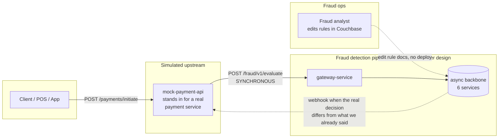
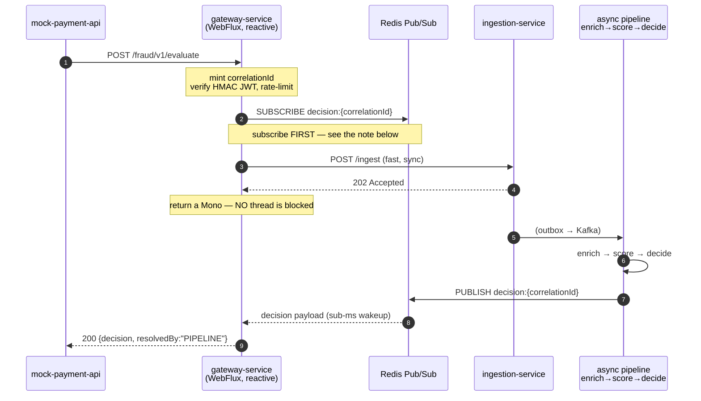
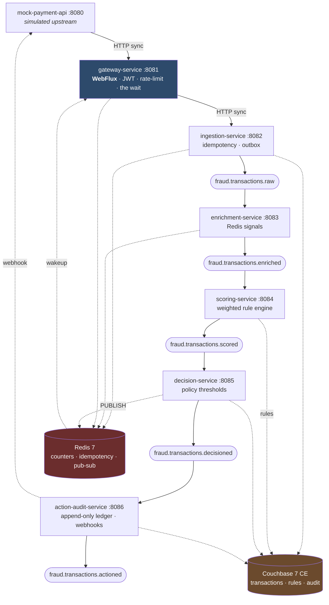

# High-Level Design

**System:** Real-time fraud detection pipeline
**Decision latency target:** p99 < 100ms warm; hard cap 150ms with a safe default
**Source of truth for requirements:** [`FRAUD_PIPELINE_BUILD_SPEC.txt`](../FRAUD_PIPELINE_BUILD_SPEC.txt)

---

## 1. The problem

A payment arrives. Before it is allowed to complete, something must decide **ALLOW**, **REVIEW**,
or **BLOCK**. Four constraints shape every decision in this document:

1. **Bounded latency.** The caller is holding a payment open. An answer that arrives in 400ms is
   not an answer.
2. **Total explainability.** For any historical decision, we must be able to say which signals
   fired, what their values were, what thresholds were in force *at that moment*, and which
   policy version applied. No opaque scoring.
3. **Ops-editable rules.** A fraud analyst must be able to change a threshold without a code
   deploy.
4. **No silent loss.** Once a transaction is accepted, it gets scored — across process crashes,
   network partitions, and duplicate client retries. The audit trail is append-only.

Constraints 1 and 4 pull in opposite directions, and the tension between them is the single most
interesting thing about this design. Section 3 is how it is resolved.

---

## 2. Context



**Why `mock-payment-api` exists at all.** This pipeline is designed to be dropped *into* an
existing payment system, not to be the front door. Without a real caller in front of it, the most
important boundary in the whole design — where the synchronous/asynchronous seam sits, and who
is blocked waiting on whom — could only ever be described, never demonstrated. `mock-payment-api`
is a real Spring Boot service that makes exactly the call a real payment service would make, and
returns a real HTTP response reflecting the fraud decision it got back. It is the thing that
makes the seam observable.

---

## 3. The central design problem: a synchronous caller over an asynchronous spine

The caller needs an answer **in this request cycle**. The pipeline wants to be **fully
asynchronous** internally — Kafka between every stage — because that buys failure isolation,
independent scaling per stage, replay, and no cascading failure when one stage is briefly slow.

Three ways to resolve that, two of which are wrong:

| Approach | Why it was rejected |
|---|---|
| **Make the whole pipeline synchronous** (chained HTTP calls) | Every stage's latency and every stage's failure becomes the caller's problem. One slow scoring node stalls payments. No replay. No independent scaling. Throws away the entire benefit of the Kafka spine. |
| **Return 202 immediately, notify later** | The caller cannot complete the payment without a decision. Pushing the decision fully async just relocates the blocking problem into the caller. |
| **✅ Sync facade over an async spine** | One synchronous leg for the fast, cheap work; a bounded, *event-driven* wait for the async spine to produce the real answer; a hard timeout with a deliberately-chosen safe default. |

### How the wait works

The critical property is that the wait is **push-based, not poll-based**.



> **Subscribe-before-ingest is mandatory, and the spec's prose has it backwards.**
> Spec §5 reads as though the gateway calls ingestion, gets its 202, and *then* opens the
> subscription. Redis Pub/Sub has no persistence and no replay — a message published to a channel
> with zero subscribers is simply gone. On a warm machine the pipeline can complete in under
> 40ms, which is comfortably faster than the gateway could finish its HTTP call to ingestion and
> then establish a subscription. The result would be a permanent race that the gateway loses
> under exactly the conditions we care about most: **a healthy, fast pipeline**. Every request
> would burn the full 150ms and return the `TIMEOUT_DEFAULT`, and the system would look like it
> was timing out constantly while in fact being perfectly healthy.
> The subscription is therefore established, and confirmed active, **before** the ingestion call
> is made. Recorded as [ADR-0003](adr/0003-pubsub-not-polling.md).

### Why not poll?

A 20ms poll loop against Couchbase or Redis adds **an average of 10ms and a worst case of 20ms
of pure waste** to *every single request*, on top of the real processing time. Against a 100ms
p99 budget that is 10–20% of the entire budget spent on nothing. It also ties up a thread per
in-flight request under a blocking servlet model, so concurrency is capped by thread-pool size
rather than by actual work.

A push-based subscription adds **sub-millisecond** wakeup latency and, on WebFlux, holds no
thread at all while waiting — the request is a suspended `Mono`, and the event-loop thread is
free to serve other requests. This is why gateway-service specifically must be reactive; it is
not stylistic.

### The timeout default is REVIEW, never ALLOW

```
                 decision arrives within 150ms  →  return it        (resolvedBy: PIPELINE)
    wait ────────┤
                 150ms elapses first            →  return REVIEW    (resolvedBy: TIMEOUT_DEFAULT)
                                                   …and the pipeline keeps running.
                                                   The real decision is still written to Couchbase,
                                                   and if it differs, a webhook reconciles.
```

Defaulting to ALLOW would mean any pipeline hiccup — a GC pause, a Kafka rebalance, a Redis blip
— silently converts into *"let every ambiguous transaction through"*. That is precisely backwards
from the system's purpose: the failure mode of a fraud system under stress must be **more**
cautious, not less. See [ADR-0004](adr/0004-review-not-allow-on-timeout.md).

Note what is *not* given up by timing out: the transaction is already durably committed and its
outbox event will be published. The timeout affects only *what we tell the caller right now*, never
whether the transaction gets scored.

---

## 4. Container view



| Service | Stack | Responsibility | Why it is its own service |
|---|---|---|---|
| `mock-payment-api` | Boot MVC | Simulated upstream caller + webhook receiver | Makes the sync/async seam demonstrable rather than hypothetical |
| `gateway-service` | Boot **WebFlux** | AuthN, rate limiting, correlation ID, **the bounded wait** | The only reactive service; holds thousands of suspended waits on a handful of threads |
| `ingestion-service` | Boot MVC | Idempotency + durable accept via outbox | Owns the durability boundary — the point after which loss is impossible |
| `enrichment-service` | Boot MVC | Compute behavioural signals | Signal computation is the most CPU/Redis-bound stage; scales independently |
| `scoring-service` | Boot MVC | Evaluate rules → objective score | **Model/ruleset** changes live here |
| `decision-service` | Boot MVC | Apply policy thresholds → ALLOW/REVIEW/BLOCK | **Business policy** changes live here — see below |
| `action-audit-service` | Boot MVC | Append-only ledger, alerts, webhook reconciliation | Side effects isolated from the decision path |

### Why scoring and decision are genuinely separate services

This is the split most likely to be questioned, and it is deliberate. They are not two classes in
one service — they are separate deployables, separate consumer groups, separate topics.

**Scoring answers an objective question:** given these signals and this ruleset, what is the
risk score? That is a property of the transaction and the model.

**Decision answers a business question:** given a risk score of 62, do we block? That is a
property of *policy*, and policy changes for reasons that have nothing to do with engineering —
a promotional period, a regulatory change, a seasonal fraud wave.

Fusing them means changing a business threshold requires redeploying the artifact that contains
the scoring logic, coupling a policy change to an engineering release cycle. Worse, it destroys
auditability: reviewing a historical decision, you could no longer distinguish *"the model
changed"* from *"the policy changed"*. Keeping them apart is what lets `rulesetVersion` and
`policyVersion` be independent fields on the decision record. [ADR-0008](adr/0008-scoring-decision-split.md).

---

## 5. Topic topology

| Topic | Partitions | Key | Retention |
|---|---|---|---|
| `fraud.transactions.raw` | 6 | `customerId` | 7d |
| `fraud.transactions.enriched` | 6 | `customerId` | 7d |
| `fraud.transactions.scored` | 6 | `customerId` | 7d |
| `fraud.transactions.decisioned` | 6 | `customerId` | 30d |
| `fraud.transactions.actioned` | 6 | `customerId` | 30d |
| `fraud.alerts.realtime` | 3 | `merchantId` | 1d |
| `fraud.transactions.raw.dlq` | 3 | `customerId` | 30d |
| `fraud.transactions.enriched.dlq` | 3 | `customerId` | 30d |
| `fraud.transactions.scored.dlq` | 3 | `customerId` | 30d |

### `customerId` as the partition key is load-bearing

Kafka guarantees ordering **within a partition**, and one partition is consumed by exactly one
instance in a consumer group. Keying by `customerId` therefore guarantees that all of one
customer's transactions are processed **in order, by a single consumer instance**.

Velocity detection depends on this completely. If a customer's events were spread across
partitions, two consumer instances could process transactions 5 and 6 concurrently, both read a
counter value of 4, both increment to 5, and the velocity rule that should fire on the 6th
transaction never fires. The Lua script (§7) makes each individual increment atomic; the
partition key is what stops two instances racing on the same customer in the first place. Both
are needed — neither is sufficient alone.

`fraud.alerts.realtime` deliberately breaks the pattern and keys by `merchantId`, because alert
consumers ask a per-merchant question ("is this merchant under attack right now?"), not a
per-customer one.

### Consumer configuration — two settings that carry real weight

**`partition.assignment.strategy = CooperativeStickyAssignor`, explicitly, on every consumer group.**
With the default eager assignor, *any* rebalance — a pod restart, a deploy, a consumer joining —
revokes **all** partitions from **all** members and reassigns from scratch. The entire consumer
group stops, including partitions that were never going to move. Cooperative rebalancing only
revokes the partitions actually being transferred; everything else keeps flowing.
[T5](TEST_PLAN.md#t5) proves this by killing an instance and asserting the untouched partitions
never gap — and is written to demonstrably *fail* under `RangeAssignor`, so it is a real proof
and not a tautology.

**Manual offset commits, after the unit of work, never before.** Auto-commit can mark a message
processed before its Couchbase write has actually landed; a crash in that window loses the
message silently. Committing only after the work is durable converts that failure mode from
*silent loss* into *safe redelivery* — which the idempotency guards then absorb.
[ADR-0010](adr/0010-manual-offset-commits.md).

---

## 6. Durability: how a transaction becomes impossible to lose

The dangerous window is between "we told the caller we accepted this" and "the pipeline can see
it". The naive implementation writes Couchbase, then publishes to Kafka, as two unrelated
operations — and a crash in between leaves a transaction durably recorded but **never scored**.
Silently. It is the worst class of bug in this system: no error, no alert, just a transaction
that quietly never got checked for fraud.

The **transactional outbox** closes it:

```mermaid
sequenceDiagram
    autonumber
    participant G as gateway
    participant I as ingestion-service
    participant R as Redis
    participant CB as Couchbase
    participant OP as OutboxPublisher<br/>(background)
    participant K as Kafka

    G->>I: POST /ingest
    I->>R: GET idempotency:{txnId}
    alt cache hit
        R-->>I: cached response
        I-->>G: 202 (same response, no reprocessing)
    else miss
        rect rgb(40,60,40)
        Note over I,CB: ONE Couchbase ACID transaction
        I->>CB: insert txn::{id}  ← insert(), never upsert()
        I->>CB: insert outbox::{uuid} status=PENDING
        CB-->>I: commit
        end
        I->>R: SETEX idempotency:{txnId}
        I-->>G: 202 Accepted
    end

    loop every 200ms
        OP->>CB: SELECT outbox WHERE status="PENDING"
        OP->>K: publish → fraud.transactions.raw
        K-->>OP: producer ACK
        OP->>CB: mark PUBLISHED  ← only after the ack
    end
```



The transaction record and its outbox record commit **atomically, in one Couchbase multi-document
ACID transaction**. After that commit, either both exist or neither does. A crash at any point
afterwards leaves a `PENDING` outbox row that the publisher picks up on restart. The transaction
is never lost — only, at worst, delayed. [T4](TEST_PLAN.md#t4) proves exactly this by freezing
the publisher between commit and publish.

### Idempotency has two layers, and the second one is the real one

1. **Redis `idempotency:{transactionId}`** — fast path. A cache hit returns the previously
   computed response without reprocessing. This is an *optimisation*.
2. **Couchbase `insert()`, never `upsert()`** — authoritative. `insert()` throws
   `DocumentExistsException` on a duplicate key. This holds even if Redis is down, was flushed,
   or two duplicate requests raced past the cache check simultaneously.

Layer 2 is what makes [T3](TEST_PLAN.md#t3) — two concurrent identical requests — resolve to
exactly one document and exactly one Kafka event. Relying on Redis alone would leave a window
where two threads both miss the cache and both proceed. [ADR-0006](adr/0006-idempotent-ingestion.md).

---

## 7. Signal computation and atomicity

Signals split across two stores on one rule: **does losing this silently produce a wrong answer?**

- **Redis** holds ephemeral, TTL-bounded working state — velocity windows, geo/device sets. Losing
  them costs detection quality for one window and sets `signalsDegraded`, loudly.
- **Couchbase** holds durable aggregates, including `lifetime_txn_count` via the **Binary
  Collection counter API** (`binary().increment(key, initial(1))`). A lifetime count that silently
  reset to zero on a cache eviction would re-enable a real false positive
  (see [ADR-0015](adr/0015-two-stores-counter-split.md)) with nothing flagging it.

Every check-then-act sequence against Redis is a **single Lua script executed via `EVAL`**, which
Redis runs atomically server-side. The canonical case:

```lua
-- velocity counter: increment, and set the TTL only on first creation
local current = redis.call('INCR', KEYS[1])
if current == 1 then
  redis.call('EXPIRE', KEYS[1], ARGV[1])
end
return current
```

Issuing `INCR` and `EXPIRE` as two round-trips from the application looks equivalent and is not.
Two concurrent requests for the same customer can interleave between the two calls such that the
`EXPIRE` is applied to a counter that a third request has already re-created — leaving a counter
that **never expires**. A customer who tripped the velocity rule once would then look permanently
guilty, and their legitimate transactions would be flagged forever, with nothing in the logs to
explain why. [ADR-0007](adr/0007-lua-atomic-counters.md).

### Degradation: fail-open, deliberately

If Redis is unavailable, enrichment **omits** the affected signals and sets `signalsDegraded:
true`. It does not default them to zero, and it does not fail the transaction.

- Defaulting to `0` is a lie — it asserts "this customer has been quiet", which is the strongest
  possible *exonerating* claim, invented from nothing.
- Omitting is honest: the rule simply cannot be evaluated, so it contributes nothing.
- Failing the transaction would mean a Redis outage stops all payments — converting a degraded
  fraud check into a total payment outage. Wrong trade for a system that sits in the payment path.

The consequence is that a Redis outage biases toward ALLOW for otherwise-clean transactions, and
this is a conscious risk acceptance, not an oversight: the Couchbase-backed signals still
evaluate, the `signalsDegraded` flag is carried onto the decision record and into the audit
ledger, and it is alertable. [T6](TEST_PLAN.md#t6) pins the behaviour.
[ADR-0014](adr/0014-redis-fail-open.md).

---

## 8. Latency budget

Total wall clock from `mock-payment-api` sending the request to receiving the decision, on a
warmed local stack:

| Hop | Budget | Notes |
|---|---:|---|
| mock-payment-api → gateway | 2ms | localhost HTTP |
| gateway: JWT HMAC verify + rate limit | 3ms | one Redis Lua round trip |
| gateway → ingestion HTTP | 3ms | |
| ingestion: Redis idempotency check | 1ms | |
| ingestion: Couchbase ACID transaction | 10ms | 2 docs, the dominant sync cost |
| outbox poll pickup | ≤10ms | 200ms tick, but a fresh row is usually caught immediately by the post-commit nudge |
| Kafka publish + raw→enrichment | 8ms | |
| enrichment: Redis signal computation | 5ms | 4 pipelined Lua calls |
| Kafka enriched→scoring | 6ms | |
| scoring: rule evaluation | 2ms | rules are cached in-process; no I/O on the hot path |
| Kafka scored→decision | 6ms | |
| decision: policy + Couchbase write | 12ms | |
| Redis PUBLISH → gateway wakeup | <1ms | push, not poll |
| **Typical total** | **≈ 69ms** | comfortably inside the 100ms p99 target |
| **Hard cap** | **150ms** | then `REVIEW` + `resolvedBy: TIMEOUT_DEFAULT` |

The ~80ms of headroom between typical and cap absorbs GC pauses, cold caches, and rebalances.
This is measured for real, not asserted — a Micrometer `Timer` wraps the full round trip and
p50/p99 are queryable from `/actuator/prometheus` after any batch of transactions.

**Where the budget would actually go if it went.** The two Couchbase writes and the four Kafka
hops dominate. The first optimisation if this were too slow is not "make the code faster" — it is
to collapse enrichment+scoring into one hop, trading a failure-isolation boundary for ~14ms.
That trade is not made here because at 69ms there is no need to.

---

## 9. Data model

```
Bucket: fraud-detection
├── Scope: transactions
│   ├── raw-transactions   txn::{transactionId}
│   └── outbox             outbox::{uuid}
├── Scope: intelligence
│   ├── fraud-rules        rule::{ruleId}   ·  policy::default
│   └── customer-profiles  profile::{customerId}  ·  mcc::{code}
│                          counter::txn::{customerId}   ← binary counter, durable, no TTL
└── Scope: audit
    ├── decisions          decision::{transactionId}
    ├── audit-ledger       audit::{transactionId}::{eventType}   ← append-only
    └── cases              case::{caseId}
```

Indexes created at init, and **verified with `EXPLAIN` in the integration suite** to use
`IndexScan` and not `PrimaryScan` — an index that exists but is not used by the planner is
indistinguishable from no index at p99:

```sql
CREATE INDEX idx_rules_enabled     ON `fraud-detection`.`intelligence`.`fraud-rules` (enabled, category);
CREATE INDEX idx_decisions_customer ON `fraud-detection`.`audit`.`decisions` (customerId, decisionAt DESC);
CREATE INDEX idx_outbox_pending    ON `fraud-detection`.`transactions`.`outbox` (status) WHERE status = "PENDING";
```

The partial index on `outbox` matters more than it looks: the publisher polls it continuously, so
it is the highest-QPS query in the system, and a partial index keeps it proportional to the
*pending backlog* rather than to *all transactions ever ingested*.

### The append-only ledger is enforced by the type system

The audit-ledger repository exposes **only** an insert-style method. No update. No delete. No
upsert. Not by convention or code review — the methods do not exist on the interface, so mutating
a historical audit record is a **compile error**.

This is aimed squarely at a future change, made by a human or an agent, that reuses a generic CRUD
repository "just to fix one record". In a regulated system that is a serious problem, and the
cheapest possible defence is to make it impossible to express. [T9](TEST_PLAN.md#t9) asserts it
reflectively so the guarantee cannot regress. [ADR-0011](adr/0011-append-only-ledger.md).

---

## 10. Rule engine and hot reload

A rule is a document:

```json
{ "docType": "FRAUD_RULE", "ruleId": "VELOCITY_1M", "signalKey": "velocity_1m",
  "operator": "GREATER_THAN", "threshold": 5, "weight": 30,
  "enabled": true, "category": "VELOCITY", "version": 1 }
```

Scoring is a sum of the weights of every enabled rule whose operator/threshold test passes against
its signal, capped at 100. Deterministic, inspectable, and trivially explainable — every
contributing rule lands in `triggeredRules` with its actual value and the threshold in force.

The eight seed rules:

| ruleId | signalKey | operator | threshold | weight |
|---|---|---|---:|---:|
| `VELOCITY_1M` | `velocity_1m` | GREATER_THAN | 5 | 30 |
| `VELOCITY_1H` | `velocity_1h` | GREATER_THAN | 20 | 20 |
| `GEO_ANOMALY` | `distinct_countries_24h` | GREATER_THAN | 1 | 25 |
| `DEVICE_SHARED` | `customers_per_device` | GREATER_THAN | 3 | 20 |
| `NEW_DEVICE_HIGH_AMOUNT` | `is_new_device_high_amt` | BOOLEAN_TRUE | — | 25 |
| `OFF_HOURS_LARGE_TXN` | `is_off_hours_large` | BOOLEAN_TRUE | — | 15 |
| `HIGH_RISK_MCC` | `merchant_risk_score` | GREATER_THAN | 80 | 20 |
| `AMOUNT_DEVIATION` | `amount_vs_p90_ratio` | GREATER_THAN | 3.0 | 20 |

**Hot reload.** Rules are cached in-process (so the hot path does no I/O) and refreshed on a 60s
timer. A fraud analyst edits the document in Couchbase and the change takes effect within a
minute with no restart. An admin `POST /admin/rules/refresh` forces it immediately — which exists
both for operational urgency and so [T8](TEST_PLAN.md#t8) can assert the behaviour without a
60-second sleep.

**Policy** is a separate document, loaded by a separate service:

```json
{ "docType": "DECISION_POLICY", "policyVersion": "v1",
  "allowBelow": 30, "blockAtOrAbove": 70 }
```

→ score < 30 = **ALLOW**, 30–69 = **REVIEW**, ≥ 70 = **BLOCK**.

---

## 11. Observability

- `/actuator/health` and `/actuator/prometheus` on all seven services.
- **Structured JSON logs with `correlationId` in the MDC on every line**, so
  `docker compose logs | grep <correlationId>` reconstructs one transaction's complete journey
  across all seven services. This is the practical face of the explainability requirement — it
  works at 3am without a tracing backend.
- scoring-service and decision-service log the full `triggeredRules` breakdown at INFO for every
  non-ALLOW decision, so explainability lives in the logs and not only in the stored document.
- A Micrometer `Timer` around the full mock-payment-api → decision round trip, plus a counter
  split by `resolvedBy`, so **"what fraction of decisions were real decisions?"** is a query, not
  a guess.

---

## 12. Failure modes

| Failure | Behaviour | How you notice |
|---|---|---|
| Redis down | Signals degrade, `signalsDegraded: true`, decisions lean ALLOW. Payments keep flowing. | `signalsDegraded` counter spikes; gateway rate limiting fails open |
| Couchbase down | Ingestion rejects with 503 — nothing is accepted that cannot be made durable | Ingest error rate; health endpoint red |
| Kafka down | Outbox rows accumulate as `PENDING`; nothing is lost; drains on recovery | Pending-outbox gauge climbs monotonically |
| A consumer crashes | Uncommitted offsets redeliver; idempotency absorbs the duplicate | Consumer lag on that partition |
| Rebalance | Only the transferring partitions pause (cooperative sticky) | Brief lag on transferring partitions only |
| Pipeline slow | Callers get `REVIEW` + `TIMEOUT_DEFAULT`; real decisions still land and reconcile by webhook | `resolvedBy=TIMEOUT_DEFAULT` ratio — the key SLO |
| Duplicate client retry | Redis cache hit, or `DocumentExistsException` → same response | Duplicate-suppressed counter |

Detail, symptoms and first response for each: [RUNBOOK.md](RUNBOOK.md).

---

## 13. Deliberate scope limits

Real in production, deliberately absent here (spec §13), each filed as a GitHub issue so the
omission is visible rather than forgotten:

- Kubernetes / Helm / any cloud resource — this runs on one machine via Docker Compose.
- Multi-broker Kafka. A single KRaft node with RF=1 is what is actually being tested; a fake
  3-broker Compose setup would be theatre, and would test nothing that RF=1 does not.
- Real OAuth2/JWKS. A shared-secret HMAC check is sufficient to demonstrate the boundary.
- ML scoring. The deterministic weighted-rule engine is the complete scope of "scoring" — and it
  is what makes total explainability achievable in the first place.
- Prometheus/Grafana containers. Micrometer instrumentation is required and present; dashboards
  are not.

---

## Related documents

[LLD](LLD.md) · [Contracts](CONTRACTS.md) · [ADRs](adr/) · [Test plan](TEST_PLAN.md) · [Runbook](RUNBOOK.md) · [Interview prep](INTERVIEW_PREP.md)
