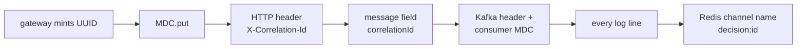

# Low-Level Design

Cross-cutting design that applies to every service. Per-service internals are in
[`docs/lld/`](lld/).

| Service | Port | Document |
|---|---:|---|
| mock-payment-api | 8080 | [mock-payment-api.md](lld/mock-payment-api.md) |
| gateway-service | 8081 | [gateway-service.md](lld/gateway-service.md) |
| ingestion-service | 8082 | [ingestion-service.md](lld/ingestion-service.md) |
| enrichment-service | 8083 | [enrichment-service.md](lld/enrichment-service.md) |
| scoring-service | 8084 | [scoring-service.md](lld/scoring-service.md) |
| decision-service | 8085 | [decision-service.md](lld/decision-service.md) |
| action-audit-service | 8086 | [action-audit-service.md](lld/action-audit-service.md) |

---

## 1. Common project shape

Every service is an independent Maven project. No parent aggregator, no shared module.

```
<service>/
├── pom.xml                 parent = spring-boot-starter-parent 4.1.0
├── Dockerfile              multi-stage: maven build → temurin JRE runtime
├── mvnw, mvnw.cmd          Maven Wrapper (script-only, no jar)
├── .mvn/wrapper/maven-wrapper.properties
└── src/
    ├── main/java/com/fraud/<service>/
    │   ├── Application.java
    │   ├── api/            controllers / listeners — the edge
    │   ├── domain/         records + business logic, no framework imports
    │   ├── infra/          Couchbase, Redis, Kafka adapters
    │   └── config/         @Configuration
    ├── main/resources/
    │   ├── application.yml
    │   └── lua/            (enrichment, gateway only)
    └── test/java/...
```

`domain/` deliberately has no Spring or driver imports. It is the part that is unit-testable with
plain JUnit and no containers, and it is where the rule evaluation and decision logic live.

## 2. Java baseline

Java 21, and the language features are used where they earn their place rather than for their own
sake:

- **Records** for every DTO and message shape. Immutability matters here — a message that a
  listener can mutate mid-processing is a debugging nightmare across seven services.
- **Sealed interfaces + pattern-matching switch** for rule operators, so adding an operator
  without handling it everywhere is a compile error:

```java
public sealed interface RuleOperator
        permits GreaterThan, LessThan, Equals, BooleanTrue {}

boolean matches(RuleOperator op, SignalValue v) {
    return switch (op) {                       // exhaustive — no default branch
        case GreaterThan g -> v.asNumber() > g.threshold();
        case LessThan l    -> v.asNumber() < l.threshold();
        case Equals e      -> v.asNumber() == e.threshold();
        case BooleanTrue b -> v.asBoolean();
    };
}
```

- **`BigDecimal` for money, always.** Never `double`. A `double` amount is a rounding bug waiting
  for a currency with more than two decimal places.

## 3. Configuration conventions

All configuration is environment-overridable so one image runs in Compose and in tests.

```yaml
spring:
  application.name: <service>
  kafka:
    bootstrap-servers: ${KAFKA_BOOTSTRAP:localhost:9092}
    consumer:
      group-id: ${KAFKA_GROUP:fraud-<stage>-group}
      enable-auto-commit: false                 # ADR-0010
      auto-offset-reset: earliest
      properties:
        partition.assignment.strategy: org.apache.kafka.clients.consumer.CooperativeStickyAssignor
        isolation.level: read_committed
    listener:
      ack-mode: MANUAL_IMMEDIATE                # ADR-0010
      concurrency: ${KAFKA_CONCURRENCY:3}
    producer:
      acks: all
      properties:
        enable.idempotence: true
        max.in.flight.requests.per.connection: 5
  data.redis:
    host: ${REDIS_HOST:localhost}
    port: ${REDIS_PORT:6379}
    timeout: 200ms                              # ADR-0014 — short, so failure is fast
couchbase:
  connection-string: ${CB_CONNECTION:couchbase://localhost}
  username: ${CB_USER:Administrator}
  password: ${CB_PASSWORD:password}
  bucket: fraud-detection
management:
  endpoints.web.exposure.include: health,info,prometheus
  metrics.tags.service: ${spring.application.name}
logging:
  structured.format.console: ecs                # Spring Boot 3.4+ native, ADR-0001
```

`acks=all` on a single-node broker with RF=1 means "the one broker has it". It is set anyway so
the configuration is correct when the topology changes, and because it costs nothing here.

## 4. Correlation ID propagation

The `correlationId` is minted once, by gateway-service, and never regenerated.



- **Inbound HTTP:** a `OncePerRequestFilter` (servlet) / `WebFilter` (WebFlux) reads
  `X-Correlation-Id` or mints one, puts it in the MDC, and clears it in a `finally`.
- **Kafka:** the ID travels both as a message field *and* as a Kafka header. The header lets a
  consumer set up the MDC before deserialization, so a message that fails to parse still logs
  with its correlation ID — which is exactly when you need it most.
- **WebFlux:** the MDC does not follow reactive operators across threads. gateway-service uses
  Reactor's `contextWrite` plus a `ContextPropagation` hook rather than a bare `ThreadLocal`. This
  is the single most common way correlation IDs silently break on WebFlux, so it is called out
  here.
- **Reset in a `finally`.** Thread pools reuse threads; a leaked MDC entry attributes one
  transaction's logs to another, which is worse than no correlation ID at all.

Result: `docker compose logs | grep <correlationId>` reconstructs the full journey across all
seven services.

## 5. Redis key schema

| Key | Type | TTL | Written by | Purpose |
|---|---|---|---|---|
| `idempotency:{transactionId}` | string (JSON) | 24h | ingestion | Cached accept-response |
| `velocity:1m:{customerId}` | counter | 60s | enrichment | `velocity_1m` |
| `velocity:1h:{customerId}` | counter | 3600s | enrichment | `velocity_1h` |
| `geo:countries:{customerId}` | set | 24h | enrichment | `distinct_countries_24h` |
| `device:customers:{deviceId}` | set | 30d | enrichment | `customers_per_device` |
| `device:known:{customerId}` | set | 90d | enrichment | `is_new_device_high_amt` |
| `ratelimit:{clientId}:{minute}` | counter | 120s | gateway | Fixed-window rate limit |
| `decision:{correlationId}` | pub/sub channel | — | decision | Wakes the waiting gateway |

Every one of these that involves a check-then-act is a Lua script ([ADR-0007](adr/0007-lua-atomic-counters.md)).

### The four Lua scripts

**`velocity.lua`** — increment, set TTL only on creation:
```lua
local current = redis.call('INCR', KEYS[1])
if current == 1 then redis.call('EXPIRE', KEYS[1], ARGV[1]) end
return current
```

**`set_add_count.lua`** — add a member, set TTL only on creation, return cardinality. Used for
both `geo:countries:*` and `device:customers:*`:
```lua
redis.call('SADD', KEYS[1], ARGV[1])
if redis.call('TTL', KEYS[1]) < 0 then redis.call('EXPIRE', KEYS[1], ARGV[2]) end
return redis.call('SCARD', KEYS[1])
```

**`known_device.lua`** — atomically test membership *and* add, returning whether it was new. The
test and the add must not be separable, or two concurrent transactions from a genuinely new
device would both report "new":
```lua
local isNew = redis.call('SISMEMBER', KEYS[1], ARGV[1]) == 0 and 1 or 0
redis.call('SADD', KEYS[1], ARGV[1])
if redis.call('TTL', KEYS[1]) < 0 then redis.call('EXPIRE', KEYS[1], ARGV[2]) end
return isNew
```

**`rate_limit.lua`** — fixed-window counter, returns the count after increment:
```lua
local current = redis.call('INCR', KEYS[1])
if current == 1 then redis.call('EXPIRE', KEYS[1], ARGV[1]) end
if current > tonumber(ARGV[2]) then return -1 end
return current
```

Scripts live in `src/main/resources/lua/` as real `.lua` files, loaded via
`RedisScript.of(new ClassPathResource(...), Long.class)`. Not inlined Java strings — they are
independently testable and readable by someone who does not read Java.

## 6. Kafka error handling and the DLQ

Every consumer wraps its listener with a `DefaultErrorHandler`:

```java
new DefaultErrorHandler(
    new DeadLetterPublishingRecoverer(kafkaTemplate, (rec, ex) ->
        new TopicPartition(rec.topic() + ".dlq", -1)),
    new FixedBackOff(200L, 2))          // 3 attempts total, then DLQ
```

- **Retryable** (Couchbase timeout, Kafka publish failure, Redis timeout): retried in place, then
  DLQ.
- **Non-retryable** (deserialization failure, unknown enum, schema violation): straight to DLQ via
  `addNotRetryableExceptions` — retrying a message that cannot be parsed just burns the partition
  three times before reaching the same conclusion.
- The DLQ envelope carries the payload as an **opaque string**, never re-parsed. See
  [CONTRACTS §7](CONTRACTS.md#7-dlq-envelope).
- **`ErrorHandlingDeserializer` wraps both key and value deserializers.** Without it, a poison
  message fails inside the consumer's `poll()` before any error handler can see it, and the
  consumer spins on the same offset forever — a genuine stuck-partition outage, not a dropped
  message.
- Offsets are committed for DLQ'd records. Moving a poison message aside *is* the successful
  outcome; leaving it uncommitted would block the partition permanently.

## 7. Health, readiness, and startup ordering

Compose orders startup with `depends_on: condition: service_healthy`, and each service exposes a
real readiness check rather than a liveness check pretending to be one:

- Kafka: `kafka-broker-api-versions.sh --bootstrap-server localhost:9092`
- Couchbase: `curl -f http://localhost:8091/pools/default` plus a bucket-exists probe
- Redis: `redis-cli ping`
- Services: `/actuator/health/readiness`, with Couchbase and Kafka contributors registered

The init containers run to completion and exit 0 before dependent services start
(`condition: service_completed_successfully`). Their scripts are **idempotent** — bucket, scope,
collection and index creation are all asynchronous in Couchbase, and creating a collection
immediately after its scope fails if the cluster has not caught up. Every step retries with
backoff and tolerates "already exists".

## 8. Resource footprint

Sized to fit a constrained machine (see [ADR-0013](adr/0013-couchbase-ce-single-node-kraft.md)).

| Container | `mem_limit` | JVM / config |
|---|---:|---|
| 7 × service | 320m each | `-XX:MaxRAMPercentage=70 -XX:+UseSerialGC -Xss512k -XX:TieredStopAtLevel=1` |
| Couchbase | 1500m | data 512 / index 256 / query quotas |
| Kafka | 800m | `KAFKA_HEAP_OPTS=-Xmx512m -Xms256m` |
| Redis | 128m | `--maxmemory 64mb --maxmemory-policy allkeys-lru` |
| **Total** | **≈ 4.6 GB** | |

`-XX:TieredStopAtLevel=1` disables the C2 JIT compiler. It cuts startup time and memory
noticeably, at the cost of peak throughput — the right trade for seven services on one laptop, and
the wrong one in production. It is set via an env var so it can be removed without a rebuild, and
**latency measurements should be taken with it off**, or the p99 numbers describe the JIT setting
rather than the design.

Compose profiles: `infra` (Kafka/Redis/Couchbase + init), `core` (infra + ingestion path),
`full` (everything).

## 9. Docker build

Multi-stage, with a BuildKit cache mount so Maven downloads once across all seven builds rather
than seven times:

```dockerfile
FROM maven:3.9-eclipse-temurin-21 AS build
WORKDIR /build
COPY pom.xml .
RUN --mount=type=cache,target=/root/.m2 mvn -B -q dependency:go-offline
COPY src ./src
RUN --mount=type=cache,target=/root/.m2 mvn -B -q clean package -DskipTests

FROM eclipse-temurin:21-jre-alpine AS runtime
RUN addgroup -S app && adduser -S app -G app
WORKDIR /app
COPY --from=build /build/target/*.jar app.jar
USER app
EXPOSE 8080
ENTRYPOINT ["sh","-c","exec java $JAVA_OPTS -jar app.jar"]
```

`pom.xml` is copied and resolved before `src`, so a source-only change reuses the cached
dependency layer. All seven runtime images share the one `eclipse-temurin:21-jre-alpine` base
layer, so the marginal cost per service is the ~40 MB jar, not a fresh JRE.

Tests are skipped in the image build and run separately via `./mvnw verify` — integration tests
need a Docker socket, and building images inside the image build is not a road worth going down.

## 10. Testing strategy

| Level | Tool | Scope |
|---|---|---|
| Unit | JUnit 5 + Mockito | `domain/` only — rule evaluation, score arithmetic, policy mapping. No containers, milliseconds. |
| Integration | Testcontainers 2.0.5 | **Real** Kafka / Redis / Couchbase per test class. Never in-memory fakes. |
| End-to-end | Compose + `smoke-test.sh` | All seven services, real HTTP, real network |

Mockito is for business logic only. Infrastructure is never mocked in integration tests — the
entire point of the §9 requirements is that they hold against real Kafka rebalancing, real
Couchbase transaction semantics and real Redis Lua atomicity, none of which a fake reproduces.

Testcontainers 2.x specifics, confirmed against the resolved classpath:

```java
// artifacts: testcontainers-kafka, testcontainers-couchbase, testcontainers-junit-jupiter
new KafkaContainer(DockerImageName.parse("apache/kafka-native:4.1.0"));   // fast startup
new CouchbaseContainer(DockerImageName.parse("couchbase/server:community-7.6.6"))
        .withEnabledServices(CouchbaseService.KV,
                             CouchbaseService.QUERY,
                             CouchbaseService.INDEX)   // never ANALYTICS/EVENTING on CE
        .withBucket(new BucketDefinition("fraud-detection"));
```

Containers are shared per class via `@Testcontainers` + `static`, and reused across classes with
`testcontainers.reuse.enable=true` where safe — on a memory-constrained machine, a fresh Couchbase
per test class is the difference between a 4-minute suite and a 25-minute one.

Full scenario coverage: [TEST_PLAN.md](TEST_PLAN.md).
