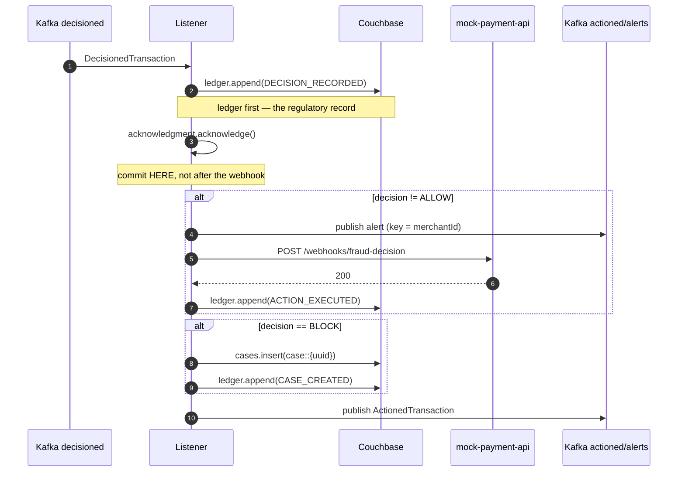

# LLD — action-audit-service

**Port 8086 · `fraud.transactions.decisioned` → `fraud.transactions.actioned` + `fraud.alerts.realtime`**

Side effects live here, isolated from the decision path so that a slow webhook receiver or a
downstream outage can never delay a decision. Owns the append-only regulatory ledger.

Consumer group: `fraud-audit-group`.

## Class design

```
api/
  DecisionedTransactionListener  @KafkaListener
domain/
  AuditLedgerEntry               record
  AuditEventType                 enum DECISION_RECORDED | ACTION_EXECUTED | CASE_CREATED
  ActionOutcome                  record
infra/
  AuditLedgerRepository          ← append() ONLY. No update. No delete. No upsert.
  CaseRepository                 BLOCK decisions
  WebhookClient                  RestClient → mock-payment-api, with retry
  AlertPublisher                 → fraud.alerts.realtime, keyed merchantId
```

## The append-only repository

```java
public interface AuditLedgerRepository {
    void append(AuditLedgerEntry entry);
    Optional<AuditLedgerEntry> findByKey(String key);
    List<AuditLedgerEntry> findByTransactionId(String transactionId);
}
```

There is no `update`, `delete`, `upsert`, `save`, `replace`, or `remove`. **The methods do not
exist**, so mutating a historical audit record is a compile error rather than a code-review
question. Full reasoning in [ADR-0011](../adr/0011-append-only-ledger.md); the short version is
that Couchbase CE has no insert-only RBAC role, so the guarantee has to come from the type system.

`append()` uses Couchbase `insert()`, keyed `audit::{transactionId}::{eventType}`, so re-appending
throws rather than overwriting. [T9](../TEST_PLAN.md#t9) asserts the absence of mutating methods
reflectively, so the guarantee cannot regress.

Corrections are made by **appending a correcting entry**, never by editing. The ledger grows
monotonically and history is reconstructed by replay.

## Flow



### The commit boundary is deliberately before the webhook

Offset commit happens after the **ledger insert**, not after the webhook succeeds.

If the commit waited on the webhook, an unreachable receiver would block the partition: no
progress, growing consumer lag, and eventually a backlog of unaudited decisions. A third party's
availability would become this pipeline's availability.

Webhook delivery is therefore retried **independently** of Kafka offset management — retried in
place with backoff, and its outcome recorded as an `ActionOutcome` on the actioned message so a
failed delivery is visible rather than silent. This is a deliberate split of "the audit record is
durable" from "the notification was delivered"; conflating them would trade a strong guarantee for
a weak one.

## Webhook reconciliation

This is the second half of [T7](../TEST_PLAN.md#t7) and the reason the timeout default is
tolerable at all.

```java
if (!decision.equals(previouslyReported)) {
    webhookClient.notify(new ReconciliationPayload(
        txnId, correlationId,
        previouslyReported,   // REVIEW — what the caller was told
        decision,             // BLOCK  — what is actually true
        riskScore, triggeredRules, policyVersion, "RECONCILIATION"));
}
```

The gateway records what it told each caller (`resolvedBy`, keyed by `correlationId`, short TTL in
Redis). When the pipeline's real decision differs from a `TIMEOUT_DEFAULT` REVIEW, the caller is
told. Having told someone REVIEW, we owe them the real answer when it arrives — otherwise a
150ms timeout would permanently degrade a transaction the pipeline was about to ALLOW.

The endpoint is **at-least-once**. Receivers must key their handling on `transactionId`, and
mock-payment-api does — a webhook retry must not double-refund.

Retry: 3 attempts, exponential backoff (200ms / 400ms / 800ms). Exhausted retries are recorded as
`WEBHOOK_NOTIFIED / FAILED` with the reason, counted, and logged at ERROR. Never silently dropped:
an undelivered reconciliation means a caller is still acting on stale information.

## Alerts

Published to `fraud.alerts.realtime` for every non-ALLOW decision, **keyed by `merchantId`** — the
one topic in the system not keyed by customer. Alert consumers ask "is this merchant under attack
right now?", which is a per-merchant aggregation, and merchant keying is what makes it ordered and
answerable. 3 partitions, 1 day retention: alerts are operational signals, not records.

## Cases

`BLOCK` decisions create `case::{uuid}` in `audit.cases` with status `OPEN`, plus a `CASE_CREATED`
ledger entry. Case *workflow* — assignment, resolution, a review UI — is out of scope and tracked
as an issue; what exists here is the durable creation of the case, which is the part the pipeline
owns.

## Metrics

| Metric | Type |
|---|---|
| `fraud.audit.ledger.appended` | Counter, tag `eventType` |
| `fraud.audit.webhook.sent` | Counter, tag `outcome` |
| `fraud.audit.webhook.latency` | Timer |
| `fraud.audit.reconciliation` | Counter | 
| `fraud.audit.case.created` | Counter |

`fraud.audit.reconciliation` pairs with the gateway's `TIMEOUT_DEFAULT` counter: together they
answer "how often did we tell a caller the wrong thing, and did we correct it?"

## Failure modes

| Failure | Behaviour |
|---|---|
| Couchbase down | No ack → redelivery. The ledger write is the unit of work. |
| Webhook receiver down | Retried, recorded as FAILED, **partition keeps moving** |
| Duplicate delivery | `DocumentExistsException` on the ledger key → counted, not an error |
| Kafka alert publish fails | Logged + counted; does not block the ledger write |
