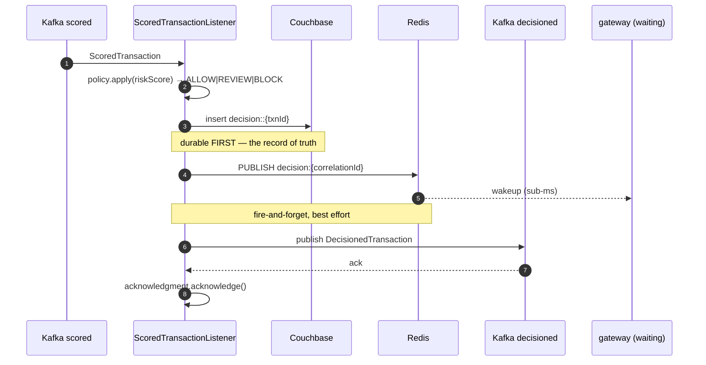

# LLD — decision-service

**Port 8085 · `fraud.transactions.scored` → `fraud.transactions.decisioned` + Redis PUBLISH**

Answers the business question: *given this risk score, what do we do?* It knows nothing about how
the score was computed ([ADR-0008](../adr/0008-scoring-decision-split.md)).

It also performs the single most latency-sensitive action in the system: the Redis publish that
wakes the waiting gateway request.

Consumer group: `fraud-decision-group`.

## Class design

```
api/
  ScoredTransactionListener      @KafkaListener
  PolicyAdminController          GET /admin/policy · POST /admin/policy/refresh
domain/
  DecisionPolicy                 record — allowBelow, blockAtOrAbove, policyVersion
  Decision                       enum ALLOW | REVIEW | BLOCK
  PolicyEvaluator                pure logic
infra/
  PolicyRepository               Couchbase policy::default
  PolicyCache                    in-process, 60s refresh
  DecisionRepository             insert decision::{transactionId}
  DecisionPublisher              Redis PUBLISH decision:{correlationId}
```

## Flow, and why the ordering is what it is



**Couchbase write before Redis publish.** The publish is an optimisation; the Couchbase document
is the record of truth. Publishing first would create a window where the gateway has told the
caller "BLOCK" but no durable record exists — if the process then died, the caller acted on a
decision the system has no memory of making. In a payment system that is an unreconcilable
discrepancy.

Writing first costs ~10ms of the latency budget and makes the guarantee unconditional: **anything
the caller was ever told is durably recorded.**

**Kafka publish after the Redis publish.** The waiting caller is on a 150ms clock; the audit
pipeline is not. Ordering the latency-sensitive step first is worth the few milliseconds.

## Policy

```json
{ "docType": "DECISION_POLICY", "policyVersion": "v1",
  "allowBelow": 30, "blockAtOrAbove": 70 }
```

```java
public Decision apply(int riskScore, DecisionPolicy p) {
    if (riskScore <  p.allowBelow())      return Decision.ALLOW;
    if (riskScore >= p.blockAtOrAbove())  return Decision.BLOCK;
    return Decision.REVIEW;
}
```

| Score | Decision |
|---|---|
| 0–29 | **ALLOW** |
| 30–69 | **REVIEW** |
| 70–100 | **BLOCK** |

Stored as a Couchbase document, not application config, so a fraud ops lead can change a threshold
with no deployment of any kind. Cached in-process with a 60s refresh and a force-refresh endpoint,
same mechanism as scoring's ruleset.

Sanity-checked on load: `0 ≤ allowBelow ≤ blockAtOrAbove ≤ 100`. An inverted policy (`allowBelow`
above `blockAtOrAbove`) would make BLOCK unreachable and silently allow everything — precisely the
fail-wide-open case this system exists to prevent, arriving via a typo in a JSON document. A
rejected policy keeps the last known good one and logs ERROR.

## The decision document

Key `decision::{transactionId}`, written with `insert()` — immutable once written. A redelivered
message throws `DocumentExistsException`, which is caught and counted, not treated as an error
(at-least-once delivery makes this normal — [ADR-0010](../adr/0010-manual-offset-commits.md)).

Carries **both** `rulesetVersion` and `policyVersion`, plus `signalsDegraded`. Those three fields
are what make a historical decision fully explainable a year later: which rules, which thresholds,
and whether the signals behind it were complete.

## The Redis publish

```java
public void publish(DecisionRecord d) {
    try {
        redis.convertAndSend("decision:" + d.correlationId(), json(d));
    } catch (Exception e) {
        log.warn("Pub/Sub publish failed correlationId={} — caller will time out to REVIEW " +
                 "and reconcile by webhook", d.correlationId(), e);
        publishFailureCounter.increment();
    }
}
```

**A failed publish is never fatal and is never retried.** The decision is already durable; the
caller times out to REVIEW; the webhook reconciles. Retrying would spend the caller's remaining
budget on a message that is very likely already too late to matter.

Redis Pub/Sub has no persistence — if the gateway is not subscribed, the message is discarded.
That is why the gateway subscribes *before* triggering ingestion
([ADR-0003](../adr/0003-pubsub-not-polling.md)), and why the timeout path and webhook
reconciliation exist as the real guarantee.

## Explainability logging

Per spec §11, the full breakdown at INFO for every non-ALLOW decision:

```
INFO  Decision transactionId=txn-8f2a… decision=REVIEW score=30
      rules=[VELOCITY_1M(+30 actual=6 threshold=5)]
      policyVersion=v1 rulesetVersion=8:sha256-3f9a… signalsDegraded=false
      correlationId=5b8e0c1a…
```

## Metrics

| Metric | Type | Purpose |
|---|---|---|
| `fraud.decision.made` | Counter, tag `decision` | ALLOW/REVIEW/BLOCK distribution |
| `fraud.decision.score` | DistributionSummary | |
| `fraud.decision.publish.failed` | Counter | Pub/Sub failures → expect matching gateway timeouts |
| `fraud.decision.duration` | Timer | |
| `fraud.decision.degraded` | Counter | Decisions made on incomplete signals |

The decision distribution is the system's business-level health signal: a sudden shift toward
BLOCK is either an attack or a bad rule edit, and both need someone looking.

## Failure modes

| Failure | Behaviour |
|---|---|
| Couchbase down | No ack → redelivery. Correct: never tell a caller something not durably recorded. |
| Redis down | Decision still written + published to Kafka. Caller times out to REVIEW, webhook reconciles. |
| Policy doc missing at startup | **Fail readiness.** Defaulting a policy would silently invent business rules. |
| Policy invalid | Keep last known good, log ERROR |
| Duplicate delivery | `DocumentExistsException` → counted, re-published to Redis (harmless — gateway takes the first) |
