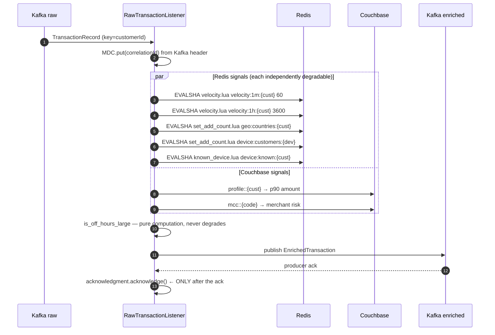

# LLD — enrichment-service

**Port 8083 · Kafka consumer → producer · `fraud.transactions.raw` → `fraud.transactions.enriched`**

Computes the behavioural signals the rule engine evaluates. This is where the Redis atomicity
requirements ([ADR-0007](../adr/0007-lua-atomic-counters.md)) and the fail-open degradation policy
([ADR-0014](../adr/0014-redis-fail-open.md)) actually live.

Consumer group: `fraud-enrichment-group`.

## Class design

```
api/
  RawTransactionListener         @KafkaListener, manual ack
domain/
  SignalSet                      Map<String,Object> + degraded key list
  SignalKey                      constants — the registry in CONTRACTS.md
infra/
  VelocitySignalSource           velocity.lua ×2
  GeoSignalSource                set_add_count.lua
  DeviceSignalSource             set_add_count.lua + known_device.lua
  ProfileSignalSource            Couchbase — MCC risk, p90 amount
  RedisScripts                   loads .lua from classpath
config/
  KafkaConsumerConfig            CooperativeStickyAssignor, MANUAL_IMMEDIATE
resources/lua/
  velocity.lua  set_add_count.lua  known_device.lua
```

## Flow



## Signal computation

| Signal | Source | Script / query |
|---|---|---|
| `velocity_1m` | Redis | `velocity.lua` on `velocity:1m:{customerId}`, TTL 60 |
| `velocity_1h` | Redis | `velocity.lua` on `velocity:1h:{customerId}`, TTL 3600 |
| `distinct_countries_24h` | Redis | `set_add_count.lua` on `geo:countries:{customerId}`, TTL 86400 |
| `customers_per_device` | Redis | `set_add_count.lua` on `device:customers:{deviceId}`, TTL 30d |
| `is_new_device_high_amt` | Redis + txn | `known_device.lua` on `device:known:{customerId}` **AND** `amount > 10000` |
| `is_off_hours_large` | txn only | hour ∈ [00:00,05:00) UTC **AND** `amount > 50000` |
| `merchant_risk_score` | Couchbase | `mcc::{merchantCategoryCode}` |
| `lifetime_txn_count` | Couchbase **binary counter** | `binary().increment("counter::txn::{customerId}", initial(1))` — durable, no expiry |
| `amount_vs_p90_ratio` | Couchbase | `amount ÷ profile::{customerId}.p90Amount`, **neutral `1.0` unless `lifetime_txn_count >= 10`** |

### The durable counter, and why it is not in Redis

```java
long lifetime = collection.binary()
    .increment("counter::txn::" + txn.customerId(),
               IncrementOptions.incrementOptions().delta(1).initial(1))
    .content();                                    // no expiry — this one is permanent
```

`increment` with `initial` is atomic and sets the starting value on creation in one operation — the
Couchbase-native equivalent of what `velocity.lua` does for the ephemeral windows.

It lives in Couchbase rather than Redis because **losing it silently produces a wrong answer**.
Redis runs `maxmemory-policy allkeys-lru`, so under pressure a lifetime counter would be evicted,
reset to zero, and re-enable the `AMOUNT_DEVIATION` false positive that the history gate exists to
prevent — with `signalsDegraded` **unset**, because Redis was up, it just forgot. A silent wrong
answer is worse than a loud missing one. → [ADR-0015](../adr/0015-two-stores-counter-split.md)

Binary counters cannot participate in `cluster.transactions().run(...)`, which is why this
increment happens here alongside the other signals rather than inside ingestion's ACID
transaction.

**The counters include the current transaction.** `velocity.lua` increments before returning, so
the 6th transaction in a minute reads `velocity_1m = 6`. That is what makes
`GREATER_THAN 5` fire on the 6th and not the 7th — an off-by-one here silently shifts every
velocity rule by one transaction, and [T2](../TEST_PLAN.md#t2) pins it.

### Why `known_device.lua` must be one script

Test-membership-then-add cannot be two calls. Two concurrent transactions from a genuinely new
device would both run `SISMEMBER` before either `SADD`, both see "not a member", and both report
`is_new_device_high_amt: true`. The rule fires twice for one genuinely-new device — inflating the
score of a transaction that should have counted it once. One script, one atomic step.

## Degradation

```java
private SignalSet computeSignals(TransactionRecord txn) {
    var signals  = new LinkedHashMap<String,Object>();
    var degraded = new ArrayList<String>();

    trySignal(signals, degraded, VELOCITY_1M, () -> velocity.oneMinute(txn.customerId()));
    trySignal(signals, degraded, VELOCITY_1H, () -> velocity.oneHour(txn.customerId()));
    // …

    // never degrades — computed from the message itself
    signals.put(IS_OFF_HOURS_LARGE, offHoursLarge(txn));

    return new SignalSet(signals, !degraded.isEmpty(), degraded);
}

private void trySignal(Map<String,Object> out, List<String> degraded,
                       String key, Supplier<Object> compute) {
    try {
        out.put(key, compute.get());
    } catch (RedisConnectionFailureException | QueryTimeoutException e) {
        degraded.add(key);              // ← OMITTED from the map, not zeroed
        degradedCounter.increment(key);
        log.warn("Signal degraded key={} correlationId={}", key, MDC.get("correlationId"));
    }
}
```

**The key is absent from the map, never `0`.** `velocity_1m: 0` is a positive assertion that the
customer has been quiet — the strongest exonerating claim available — invented from nothing during
an outage and indistinguishable from a real measurement in the stored decision record. Absence is
honest: the rule cannot be evaluated, so it does not fire. Full reasoning:
[ADR-0014](../adr/0014-redis-fail-open.md). [T6](../TEST_PLAN.md#t6) asserts **key absence**
explicitly, which is what distinguishes correct behaviour from the zero-defaulting variant.

Each signal degrades independently — one dead signal does not take the others with it. Redis
timeout is 200ms, short enough that a hung Redis costs latency rather than the whole 150ms budget.

## Consumer configuration

```yaml
spring.kafka.consumer:
  group-id: fraud-enrichment-group
  enable-auto-commit: false
  properties:
    partition.assignment.strategy: org.apache.kafka.clients.consumer.CooperativeStickyAssignor
spring.kafka.listener:
  ack-mode: MANUAL_IMMEDIATE
  concurrency: 3
```

Ack **after** the producer ack on `fraud.transactions.enriched`
([ADR-0010](../adr/0010-manual-offset-commits.md)). Committing before would mean a crash in that
window loses the message silently.

### The one place at-least-once is not naturally idempotent

Replaying a message re-increments the velocity counter. This is the sharp edge of at-least-once
delivery in this system and it is worth being honest about: `customerId` keying
([ADR-0012](../adr/0012-customer-id-partition-key.md)) plus cooperative rebalancing
([ADR-0009](../adr/0009-cooperative-sticky-assignor.md)) reduce duplicate processing to genuine
crash-recovery cases, where a briefly inflated velocity count biases toward caution — a fail-safe
error, not a fail-open one.

Making it exactly-once would mean a dedupe set keyed by `transactionId` checked inside the same
Lua script. That is deliberately not done: it doubles Redis state for a rare, self-correcting,
safe-direction error. Noted so the omission is a decision rather than an oversight.

## Metrics

| Metric | Type |
|---|---|
| `fraud.enrichment.processed` | Counter |
| `fraud.enrichment.signal.degraded` | Counter, tag `signal` |
| `fraud.enrichment.duration` | Timer |
| `fraud.enrichment.redis.latency` | Timer |

## Failure modes

| Failure | Behaviour |
|---|---|
| Redis down | Signals omitted, `signalsDegraded: true`, processing continues |
| Couchbase down | `merchant_risk_score` / `amount_vs_p90_ratio` degrade; Redis signals still computed |
| Kafka producer fails | No ack → no commit → redelivery |
| Malformed message | 3 attempts → `fraud.transactions.raw.dlq` |
| Rebalance | Only transferring partitions pause |
