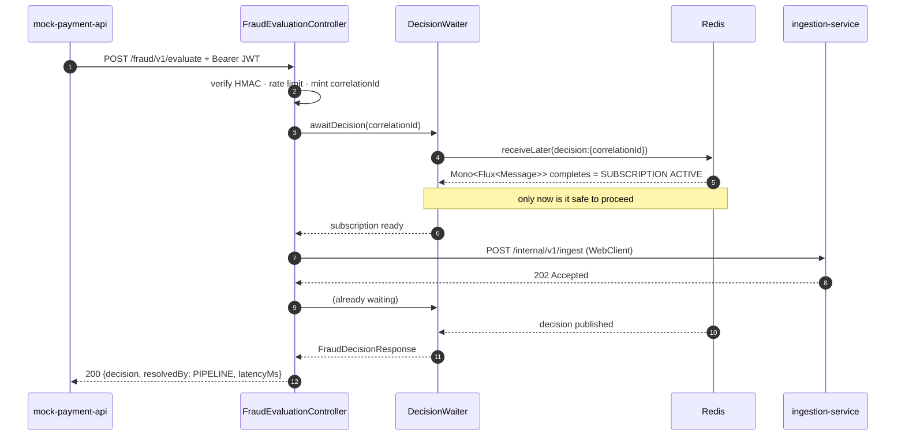

# LLD — gateway-service

**Port 8081 · Spring WebFlux (reactive) · the only reactive service in the system**

This is the most subtle service in the build. Everything else is a straightforward
consumer-transform-produce loop; this one holds a bounded, non-blocking wait bridging a
synchronous caller to an asynchronous pipeline.

## Responsibilities

1. Verify a shared-secret HMAC JWT.
2. Rate limit per client.
3. Mint the `correlationId` that every downstream service and log line carries.
4. **Subscribe** to `decision:{correlationId}` on Redis Pub/Sub.
5. Call ingestion-service (fast, synchronous, expects 202).
6. Wait up to 150ms for the decision; on timeout return REVIEW.

## Why reactive, specifically

At any moment this service holds N suspended waits, one per in-flight payment. Under a blocking
servlet model that is N parked threads, and concurrency is capped by the thread pool rather than
by real work — 200 concurrent payments means 200 threads doing nothing but waiting.

On WebFlux a suspended `Mono` holds **no thread**. The event loop is free between the subscribe
and the wakeup. This is the entire justification for the asymmetry, and it is why introducing any
blocking call into this service's request path would quietly destroy its scaling property.

## Class design

```
api/
  FraudEvaluationController      POST /fraud/v1/evaluate
  CorrelationIdWebFilter         mint/propagate correlationId into the Reactor context
config/
  SecurityConfig                 HMAC JWT filter
  RedisConfig                    ReactiveRedisMessageListenerContainer, ReactiveStringRedisTemplate
  WebClientConfig                WebClient → ingestion-service
domain/
  FraudDecisionResponse          record
  DecisionSource                 enum { PIPELINE, TIMEOUT_DEFAULT }
infra/
  DecisionWaiter                 ← the heart of the service
  IngestionClient                reactive WebClient wrapper
  HmacJwtVerifier                hand-rolled HMAC-SHA256 verification
  RateLimiter                    Lua-backed fixed window
```

## The request flow



### `DecisionWaiter` — the critical code

```java
public Mono<FraudDecisionResponse> awaitDecision(String correlationId, Mono<Void> ingestTrigger) {
    ChannelTopic topic = ChannelTopic.of("decision:" + correlationId);

    return listenerContainer.receiveLater(topic)          // Mono<Flux<Message>>
        .flatMapMany(flux -> flux)                        // completes ONLY when subscribed
        .next()                                           // first message wins
        .map(msg -> parse(msg.getMessage()))
        .timeout(Duration.ofMillis(150))
        .onErrorResume(TimeoutException.class,
                       e -> Mono.just(timeoutDefault(correlationId)))
        .doOnSubscribe(s -> ingestTrigger.subscribe());   // ingest AFTER subscription
}
```

> **`receiveLater()` rather than `receive()` is the whole point.** `receive()` returns a `Flux`
> that subscribes lazily — you have no way to know when the subscription is actually established
> on the Redis connection. `receiveLater()` returns a `Mono<Flux<Message>>` that **completes once
> the subscription is confirmed active**. Only then is it safe to trigger ingestion.
>
> Get this wrong and you have the race described in
> [ADR-0003](../adr/0003-pubsub-not-polling.md): on a warm stack the pipeline finishes in under
> 40ms, publishes into a channel with no subscriber, the message evaporates, and the gateway times
> out. Every request. The failure gets *worse* as the pipeline gets *faster*, which is a
> memorably confusing thing to debug.

### Timeout path

```java
private FraudDecisionResponse timeoutDefault(String correlationId) {
    log.warn("Decision timeout, defaulting to REVIEW correlationId={}", correlationId);
    timeoutCounter.increment();
    return new FraudDecisionResponse(..., Decision.REVIEW, 0,
                                     List.of(), DecisionSource.TIMEOUT_DEFAULT);
}
```

REVIEW, never ALLOW — [ADR-0004](../adr/0004-review-not-allow-on-timeout.md). The pipeline is
**not** cancelled; the real decision still lands in Couchbase and reconciles by webhook.

### Subscription cleanup

Both the success and timeout paths must tear down the subscription, or the listener container
leaks a channel per timed-out request and Redis accumulates dead subscriptions until it stops
accepting new ones. `.next()` cancels upstream after the first element; the timeout path cancels
via `onErrorResume`. A `doFinally` asserts teardown and is covered by a test that fires 1 000
timed-out requests and asserts the container's channel count returns to zero.

## MDC on WebFlux

`ThreadLocal`-based MDC **does not work** across reactive operators — the chain hops threads and
the MDC is lost, usually silently, so logs simply have no correlation ID and nobody notices until
an incident.

`CorrelationIdWebFilter` writes into the Reactor `Context`:

```java
return chain.filter(exchange)
    .contextWrite(ctx -> ctx.put(CORRELATION_ID, correlationId));
```

with `Hooks.enableAutomaticContextPropagation()` at startup bridging Context → MDC for logging.
This is the single most common way correlation IDs break on WebFlux.

## HMAC JWT

Hand-rolled, ~40 lines, no dependency:

```
Authorization: Bearer <base64url(header)>.<base64url(payload)>.<base64url(HMAC-SHA256)>
```

Verified with `javax.crypto.Mac` and `MessageDigest.isEqual` for **constant-time comparison** — a
`String.equals` on a MAC is a timing oracle. Secret from `JWT_SECRET`.

**The `exp` claim is enforced** ([#27](../../issues/27)). The signature check alone left the
minter's `exp = iat + 300` decorative, which meant a token that leaked once was valid forever —
the bounded lifetime is the main thing limiting the blast radius of a token pulled from a log or a
captured request. Three details are deliberate:

- **Signature first, claims second.** `exp` is only parsed after `MessageDigest.isEqual` passes.
  Parsing claims out of an unverified token is acting on attacker-controlled input, and doing it in
  this order is also what makes extending `exp` require the secret.
- **A missing `exp` is a rejection, not a licence.** Treating "no expiry claim" as "never expires"
  hands anyone able to influence the payload the trivial bypass: omit the field. Same for a
  non-numeric one, which is a clean `false` rather than a 500 — otherwise malformed input becomes a
  denial-of-service surface.
- **60s clock-skew tolerance**, so minor NTP drift between services does not present as intermittent
  401s with no bad actor involved. Well below the 300s lifetime, so it does not meaningfully extend
  the window.

`nbf` and `iat` are not checked. The only minter never sets `nbf`, and forging one requires the
shared secret, so it is a gap at the trust boundary rather than a live exposure — tracked separately.

`jjwt` was considered and rejected: its Jackson binding pulls Jackson 2 into a Jackson 3 build for
what amounts to 40 lines of `Mac.doFinal`. Spec §13 explicitly accepts a shared-secret check as
sufficient; a real IdP with JWKS is [tracked as an issue](../../issues).

## Rate limiting

Fixed window, one Lua round trip (`rate_limit.lua`), keyed `ratelimit:{clientId}:{minute}`.
Default 100 req/min, `RATE_LIMIT_RPM`-overridable. Returns `429` with `Retry-After` when exceeded.

**Fails open** if Redis is unavailable — consistent with
[ADR-0014](../adr/0014-redis-fail-open.md). This is a deliberate choice on a security control and
is stated explicitly rather than left implicit: a Redis outage must not stop payments.

## Metrics

| Metric | Type | Purpose |
|---|---|---|
| `fraud.gateway.decision.latency` | Timer | Full round trip; p50/p99 |
| `fraud.gateway.decision.resolved` | Counter, tag `source` | **`TIMEOUT_DEFAULT ÷ total` is the system's primary SLO** |
| `fraud.gateway.ratelimit.rejected` | Counter | |
| `fraud.gateway.auth.failed` | Counter | |

## Failure modes

| Failure | Behaviour |
|---|---|
| Redis down at subscribe | Cannot wait → return REVIEW `TIMEOUT_DEFAULT` immediately, log ERROR. Pipeline still runs. |
| ingestion-service down | 503 to caller. Correct: nothing was made durable, so promising a decision would be a lie. |
| Pipeline slow | REVIEW at 150ms + webhook reconciliation |
| Malformed JWT | 401, no pipeline work |
| Expired JWT (or one with no `exp`) | 401, no pipeline work. 60s skew tolerance — see [#27](../../issues/27) |

Note the asymmetry: a *Redis* failure still returns a usable answer, because the transaction may
still be ingested. An *ingestion* failure returns 503, because nothing was persisted and there is
nothing to reconcile later. Failing loudly is right when the alternative is a promise you cannot
keep.
