# LLD — ingestion-service

**Port 8082 · Spring MVC · owns the durability boundary**

Once `POST /internal/v1/ingest` returns 202, the transaction **cannot be lost**. Everything before
that point may fail freely; everything after is recoverable. That single property is this
service's entire reason to exist.

## Responsibilities

1. Idempotency — Redis fast path, Couchbase `insert()` as the authority.
2. Write the transaction record **and** its outbox record in one Couchbase ACID transaction.
3. Return 202 immediately.
4. Publish outbox rows to Kafka in the background, marking `PUBLISHED` only after producer ack.

## Class design

```
api/
  IngestionController            POST /internal/v1/ingest
domain/
  TransactionRecord              record
  OutboxEvent                    record, status PENDING | PUBLISHED
  IngestionResult                record
infra/
  TransactionRepository          insert() only — never upsert()
  OutboxRepository               findPending / markPublished
  IdempotencyCache               Redis
  OutboxPublisher                @Scheduled + post-commit nudge
config/
  CouchbaseConfig                Cluster bean, transactions config
```

## Ingest flow

```mermaid
sequenceDiagram
    autonumber
    participant G as gateway
    participant C as IngestionController
    participant R as Redis
    participant CB as Couchbase

    G->>C: POST /internal/v1/ingest
    C->>R: GET idempotency:{txnId}
    alt hit
        R-->>C: cached IngestionResult
        C-->>G: 202 (same result, nothing reprocessed)
    else miss
        rect rgb(35,60,35)
        Note over C,CB: ONE ACID transaction — both docs or neither
        C->>CB: ctx.insert(txn::{id})
        C->>CB: ctx.insert(outbox::{uuid})
        CB-->>C: commit
        end
        C->>R: SETEX idempotency:{txnId} 86400
        C-->>G: 202 Accepted
        C->>C: nudge OutboxPublisher
    end
```



### The Couchbase transaction

```java
cluster.transactions().run(ctx -> {
    ctx.insert(rawTxnCollection, "txn::" + txn.transactionId(), txnDoc);
    ctx.insert(outboxCollection, "outbox::" + UUID.randomUUID(), outboxDoc);
});
```

`ctx.insert(...)`, never `ctx.upsert(...)`. `insert()` throws `DocumentExistsException` on a
duplicate key, which is the **authoritative** idempotency guard —
[ADR-0006](../adr/0006-idempotent-ingestion.md). This holds even when Redis is down, was flushed,
or two duplicate requests raced past the cache check simultaneously.

The exception is caught and treated as normal control flow:

```java
} catch (TransactionFailedException e) {
    if (hasCause(e, DocumentExistsException.class)) {
        duplicateCounter.increment();
        log.debug("Duplicate suppressed transactionId={}", txn.transactionId());
        return readExisting(txn.transactionId());   // same identity; status=DUPLICATE
    }
    throw e;
}
```

Logged at DEBUG and counted, never at ERROR. A duplicate is expected traffic — clients retry after
ambiguous timeouts. Logging it as an error trains people to ignore errors.

> `TransactionFailedException` wraps the cause, so the check must unwrap rather than
> `catch (DocumentExistsException)`. Catching the unwrapped type is a bug that only shows up under
> the concurrent duplicate case — which is exactly what [T3](../TEST_PLAN.md#t3) exercises.

### Why both documents in one transaction

Separately: crash between them and the transaction is durably recorded but **never scored**,
silently. See [ADR-0005](../adr/0005-transactional-outbox.md) for the full failure analysis. This
is the single most important guarantee in the service.

## OutboxPublisher

```java
@Scheduled(fixedDelayString = "${outbox.poll-interval-ms:200}")
public void publishPending() {
    if (!enabled) return;                                  // ← test hook for T4
    for (OutboxEvent e : outboxRepository.findPending(BATCH_SIZE)) {
        SendResult<String,String> ack =
            kafkaTemplate.send(e.targetTopic(), e.payload().customerId(), json(e.payload()))
                         .get(5, TimeUnit.SECONDS);        // block for the ack
        outboxRepository.markPublished(e.id());            // ONLY after the ack
    }
}
```

- Query uses `idx_outbox_pending`, a **partial** index (`WHERE status = "PENDING"`) so its cost
  tracks the pending backlog rather than all transactions ever ingested. This is the
  highest-QPS query in the system.
- **Marking `PUBLISHED` happens strictly after the producer ack.** Reversing these makes the outbox
  pointless — a crash between them would lose the very message the pattern exists to protect.
- A post-commit nudge (`ApplicationEventPublisher` → `@Async` trigger) wakes the publisher
  immediately, so the outbox contributes ~0ms to the hot path while the 200ms timer remains the
  correctness backstop. **Both** are needed: the nudge is the optimisation, the timer is the
  guarantee.
- Producer is configured `acks=all`, `enable.idempotence=true`.

### The `enabled` flag is a test hook, and it is deliberate

`outbox.publisher.enabled=false` freezes the publisher after commit, before publish. This is how
[T4](../TEST_PLAN.md#t4) simulates a crash in the dangerous window without actually killing a
process, then asserts the row stays `PENDING` and republishes on restart. It exists in main code
because the alternative — killing containers mid-test — is slow and flaky.

## Idempotency cache

`idempotency:{transactionId}` → serialized `IngestionResult`, TTL 24h. A **fast path only**; all
correctness comes from `insert()`. Redis being down degrades latency, never correctness
([ADR-0014](../adr/0014-redis-fail-open.md)).

## Metrics

| Metric | Type | Purpose |
|---|---|---|
| `fraud.ingestion.accepted` | Counter | |
| `fraud.ingestion.duplicate.suppressed` | Counter | Health signal, not an error |
| `fraud.ingestion.outbox.pending` | **Gauge** | Should hover near zero. Monotonic climb = Kafka unreachable or publisher dead. Earliest signal of either. |
| `fraud.ingestion.outbox.publish.latency` | Timer | Commit → Kafka ack |
| `fraud.ingestion.transaction.duration` | Timer | Couchbase ACID transaction |

## Failure modes

| Failure | Behaviour |
|---|---|
| Couchbase down | **503, reject.** Nothing is accepted that cannot be made durable — the one place this system fails closed, because accepting without durability is a lie. |
| Redis down | Proceed. `insert()` still enforces idempotency. Slower, still correct. |
| Kafka down | Commit succeeds, 202 returned, outbox accumulates `PENDING`, drains on recovery. **Nothing lost.** |
| Duplicate `transactionId` | Cache hit or `DocumentExistsException` → same `transactionId` + `correlationId`, `status=DUPLICATE` |
| Crash mid-transaction | Couchbase rolls back; client retries; `insert()` handles it |
| Crash after commit, before publish | Row stays `PENDING`; republished on restart — [T4](../TEST_PLAN.md#t4) |

Note the deliberate asymmetry with Redis and Kafka: this service fails **closed** on Couchbase and
**open** on everything else, because Couchbase is the only dependency whose absence makes the 202
untrue.
