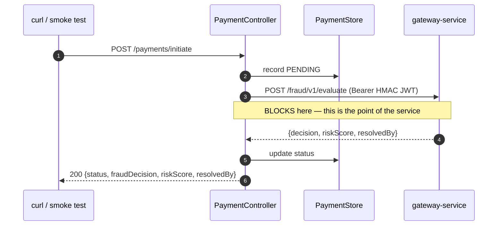

# LLD — mock-payment-api

**Port 8080 · Spring MVC · the simulated upstream caller**

Not part of the fraud pipeline. It stands in for a **pre-existing payment service** that the
pipeline is dropped into.

## Why it exists

The fraud pipeline is designed to be integrated into an existing payment system, not to be the
front door itself. Without a real caller in front of it, the most important boundary in the whole
design — where the synchronous/asynchronous seam sits, and who is blocked waiting on whom — could
only ever be *described*, never *demonstrated*.

This service is what makes the seam observable: it makes exactly the internal call a real payment
service would make, blocks on the answer the way a real payment service must, and returns a real
HTTP response reflecting the fraud decision it received. It is also the webhook receiver, which
makes reconciliation demonstrable end-to-end rather than hypothetical.

It is deliberately thin. It is not the thing being built.

## Class design

```
api/
  PaymentController          POST /payments/initiate
  FraudWebhookController     POST /webhooks/fraud-decision
domain/
  PaymentRequest             record
  PaymentResponse            record
  PaymentStatus              enum COMPLETED | HELD | DECLINED
infra/
  FraudGatewayClient         RestClient → gateway-service, with the HMAC JWT
  PaymentStore               in-memory ConcurrentHashMap — deliberately not a database
```

`PaymentStore` is an in-memory map on purpose. Giving this service real persistence would invite
treating it as part of the system under test. It is a stub with a pulse.

## Payment flow



### Decision → payment status

```java
PaymentStatus status = switch (fraud.decision()) {
    case ALLOW  -> PaymentStatus.COMPLETED;
    case REVIEW -> PaymentStatus.HELD;
    case BLOCK  -> PaymentStatus.DECLINED;
};
```

`REVIEW → HELD` is what makes the timeout default a *real business state* rather than a fudge. A
held payment is recoverable — it can be released on reconciliation. A fraudulent completed payment
often is not. That asymmetry is the entire argument in
[ADR-0004](../adr/0004-review-not-allow-on-timeout.md), and this switch statement is where it
becomes concrete.

### Client timeout must exceed the gateway's

```yaml
fraud.gateway.connect-timeout: 500ms
fraud.gateway.read-timeout: 2000ms      # >> the gateway's own 150ms budget
```

The read timeout is deliberately far above 150ms. The gateway is guaranteed to answer within its
own budget — either the real decision or the REVIEW default — so a client timeout *below* that
would abort a request that was about to succeed, and produce an error where the system was
working correctly. Every retry would then create a duplicate transaction, which the idempotency
guards absorb but which pollutes the picture for no reason.

If the gateway itself is unreachable, the payment is **DECLINED**, not completed: a payment
service that cannot reach its fraud check must not assume approval. Same reasoning as
[ADR-0004](../adr/0004-review-not-allow-on-timeout.md), one layer up.

## Webhook receiver

```java
@PostMapping("/webhooks/fraud-decision")
public ResponseEntity<Void> reconcile(@RequestBody ReconciliationPayload p) {
    store.compute(p.transactionId(), (id, existing) -> {
        if (existing == null) return null;
        if (existing.reconciledAt() != null) {      // at-least-once — idempotent
            duplicateWebhookCounter.increment();
            return existing;
        }
        return existing.reconciled(p.finalDecision(), p.riskScore());
    });
    log.info("Reconciled transactionId={} {} → {} correlationId={}",
             p.transactionId(), p.previousDecision(), p.finalDecision(), p.correlationId());
    return ResponseEntity.ok().build();
}
```

**Idempotent by `transactionId`.** The webhook is at-least-once, so a retry must not apply the
reconciliation twice — in a real payment system that is a double refund or a double reversal. The
guard is the `reconciledAt` check.

`GET /payments/{transactionId}` exposes the stored record including `reconciledAt`, which is how
[T7](../TEST_PLAN.md#t7) asserts that reconciliation actually happened rather than merely that a
webhook was sent.

## JWT minting

Mints a short-lived HMAC-SHA256 JWT with the shared secret from `JWT_SECRET` (same value the
gateway verifies with). This is spec §13's accepted simplification — a real IdP with JWKS is
[tracked as an issue](../../issues). Documented here so the shortcut is visible in the code's own
documentation, not only in the README.

## Test hooks

A `test` profile exposes `POST /test/delay?ms=N`, which injects a delay into the pipeline (via a
header the enrichment service honours under the same profile) to force the gateway's 150ms timeout
path for [T7](../TEST_PLAN.md#t7). Guarded by `@Profile("test")` so it cannot exist in a normal
run.

## Metrics

| Metric | Type | Purpose |
|---|---|---|
| `payment.initiated` | Counter | |
| `payment.status` | Counter, tag `status` | COMPLETED / HELD / DECLINED split |
| `payment.fraud.latency` | **Timer** | **The end-to-end number spec §11 requires** — full round trip from here to decision received. p50/p99 queryable from `/actuator/prometheus`. |
| `payment.webhook.received` | Counter | |
| `payment.webhook.duplicate` | Counter | |

`payment.fraud.latency` is the headline measurement: it is taken at the outermost caller, so it
includes every hop and every queue, and it is the only latency number that reflects what a real
client would experience.
